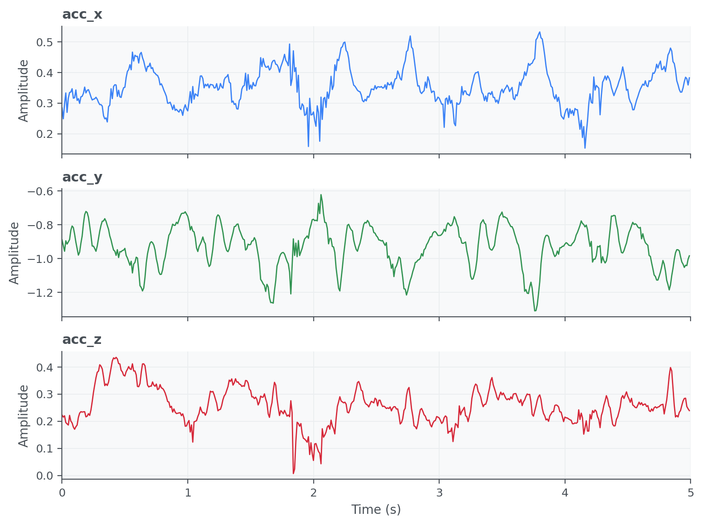
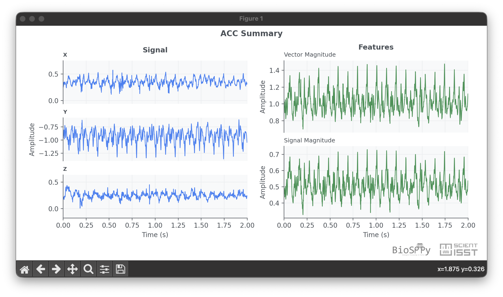

Accelerometer (ACC)
===================

Accelerometer (ACC) signals capture body movement and orientation from linear
acceleration measured along one or more axes. In biosignal workflows, ACC is
commonly used to quantify physical activity, estimate posture transitions, and
provide motion context for other modalities such as ECG or PPG.

API quick links: :py:mod:`biosppy.signals.acc` | :py:func:`biosppy.signals.acc.acc`

Quick Usage with :py:func:`biosppy.signals.acc.acc`
---------------------------------------------------

.. code-block:: python

    import numpy as np
    from biosppy.signals import acc

    # Load a sample ACC recording (one or multiple axes).
    signal = np.loadtxt("examples/acc.txt")

    # sampling_rate is in Hz; show=False avoids opening the plot window.
    out = acc.acc(signal=signal, sampling_rate=100.0, show=False)

    # ReturnTuple behaves like a tuple + dict-style keys.
    print(out.keys())

**Inputs**

- ``signal``: ACC samples (typically N x channels).
- ``sampling_rate``: acquisition frequency in Hz.
- ``units`` / ``path`` / ``show``: optional metadata, output path, and plotting control.

**Outputs**

- A ``ReturnTuple`` with processed ACC information (timestamps, filtered views,
  and activity-related descriptors).
- Use ``out.keys()`` to inspect all available outputs in your installed version.

Example of ACC summary plot:

