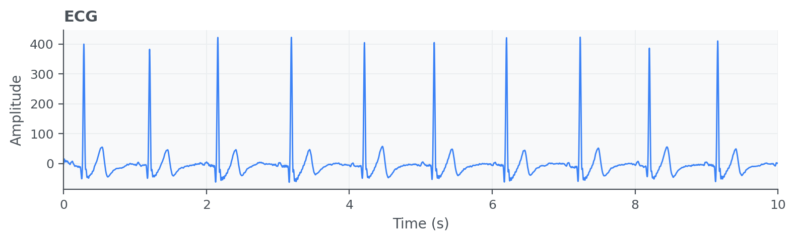

Electrocardiogram (ECG)
=======================

Electrocardiogram (ECG/EKG) signals describe the electrical activity of the
heart and are widely used to characterize cardiac rhythm and morphology. ECG
processing pipelines typically include filtering, heartbeat detection, and heart
rate estimation as foundational analysis steps.

API quick links: :py:mod:`biosppy.signals.ecg` | :py:func:`biosppy.signals.ecg.ecg`

Quick Usage with :py:func:`biosppy.signals.ecg.ecg`
---------------------------------------------------

.. code-block:: python

    import numpy as np
    from biosppy.signals import ecg

    signal = np.loadtxt("examples/ecg.txt")

    out = ecg.ecg(signal=signal, sampling_rate=1000.0, show=False)
    print(out.keys())

**Inputs**

- ``signal``: raw ECG samples.
- ``sampling_rate``: acquisition frequency in Hz.
- ``units`` / ``path`` / ``show``: optional label, save path, and plotting control.

**Outputs**

- A ``ReturnTuple`` with processed ECG information, including time axis,
  filtered signal, detected R-peaks, and instantaneous heart-rate related outputs.
- Use ``out.keys()`` to inspect the complete output set.

Example of ECG summary plot:

.. image:: ../images/plots/ecg_summary.png
   :align: center
   :width: 100%
   :alt: Example ECG signal summary plot.