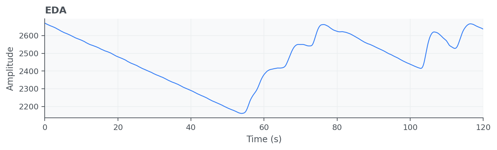
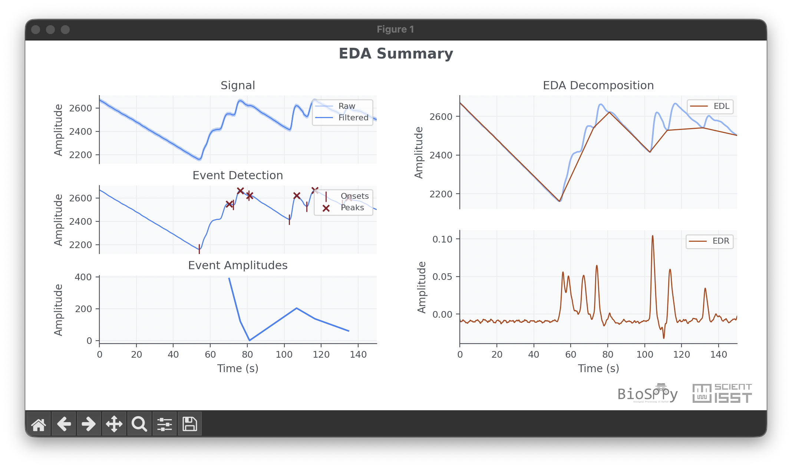

Electrodermal Activity (EDA)
============================

Electrodermal Activity (EDA) signals reflect variations in skin conductance and
are strongly associated with sympathetic nervous system activation. EDA is
frequently used in stress and arousal studies by separating tonic and phasic
components of the skin response.

API quick links: :py:mod:`biosppy.signals.eda` | :py:func:`biosppy.signals.eda.eda`

Quick Usage with :py:func:`biosppy.signals.eda.eda`
---------------------------------------------------

.. code-block:: python

    import numpy as np
    from biosppy.signals import eda

    signal = np.loadtxt("examples/eda.txt")

    out = eda.eda(signal=signal, sampling_rate=1000.0, show=False)
    print(out.keys())

**Inputs**

- ``signal``: raw EDA/skin conductance signal.
- ``sampling_rate``: acquisition frequency in Hz.
- ``min_amplitude`` / ``size``: optional parameters for SCR-related detection.

**Outputs**

- A ``ReturnTuple`` with EDA processing results such as filtered signal,
  onsets/peaks, and amplitude-related descriptors.
- Use ``out.keys()`` to inspect all returned fields.

Example of EDA summary plot:

