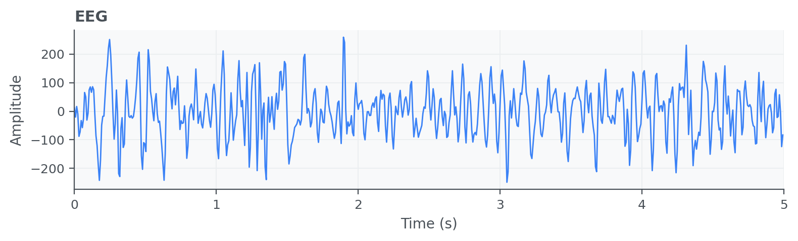
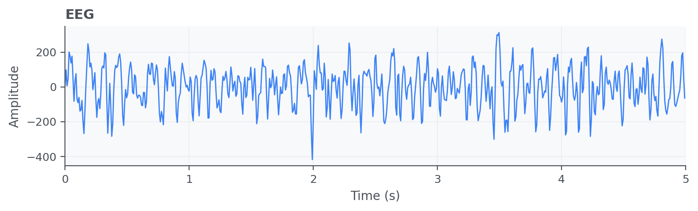

Electroencephalogram (EEG)
==========================

Electroencephalogram (EEG) signals measure electrical brain activity using
scalp electrodes and enable time-domain and frequency-domain analysis of neural
dynamics. EEG processing is commonly used for cognitive state assessment,
sleep staging, and event-related studies.

API quick links: :py:mod:`biosppy.signals.eeg` | :py:func:`biosppy.signals.eeg.eeg`

Quick Usage with :py:func:`biosppy.signals.eeg.eeg`
---------------------------------------------------

.. code-block:: python

    import numpy as np
    from biosppy.signals import eeg

    # EEG processing expects channels in columns for multichannel data.
    signal = np.loadtxt("examples/eeg_ec.txt")

    out = eeg.eeg(signal=signal, sampling_rate=1000.0, show=False)
    print(out.keys())

**Inputs**

- ``signal``: EEG samples (N x channels).
- ``sampling_rate``: acquisition frequency in Hz.
- ``labels``: optional channel labels for readable plots/results.

**Outputs**

- A ``ReturnTuple`` with EEG processing results such as filtered signals and
  derived channel-wise descriptors.
- Use ``out.keys()`` to inspect all outputs.
