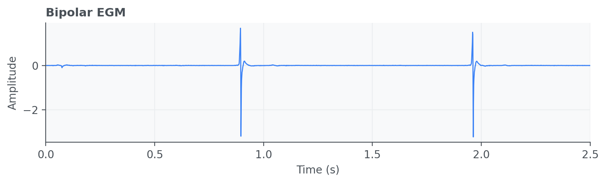

Electrogram (EGM)
=================

Electrogram (EGM) signals are intracardiac electrical recordings acquired by
catheters or implanted leads, offering localized information about atrial or
ventricular activation. EGM analysis is useful in electrophysiology workflows,
including rhythm characterization and arrhythmia assessment.

API quick links: :py:mod:`biosppy.signals.egm` | :py:func:`biosppy.signals.egm.egm`

Quick Usage with :py:func:`biosppy.signals.egm.egm`
---------------------------------------------------

.. code-block:: python

    import numpy as np
    from biosppy.signals import egm

    signal = np.loadtxt("examples/egm_bipolar_sinus.txt")

    out = egm.egm(
        signal=signal,
        sampling_rate=1000.0,
        type="bipolar",
        show=False,
    )
    print(out.keys())

**Inputs**

- ``signal``: intracardiac EGM waveform.
- ``sampling_rate``: acquisition frequency in Hz.
- ``type`` / ``rhythm`` / ``method`` / ``threshold``: options controlling
  morphology and event-detection behavior.

**Outputs**

- A ``ReturnTuple`` with filtered EGM signals and arrhythmia/event-related
  descriptors according to the chosen method.
- Use ``out.keys()`` to inspect exact return fields.
