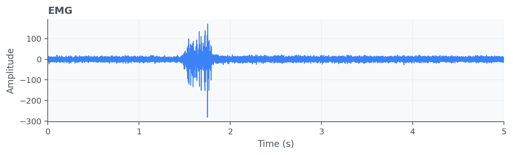
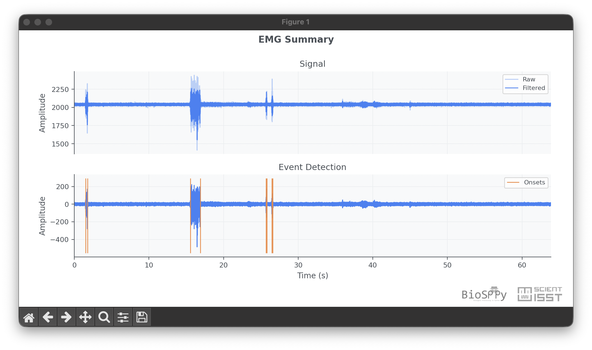

Electromyogram (EMG)
====================

Electromyogram (EMG) signals measure muscle electrical activity and are often
analyzed to detect activation bursts, fatigue patterns, and neuromuscular
control behavior. Surface EMG enables non-invasive acquisition and supports
applications in rehabilitation, sports, and human-computer interaction.

API quick links: :py:mod:`biosppy.signals.emg` | :py:func:`biosppy.signals.emg.emg`

Quick Usage with :py:func:`biosppy.signals.emg.emg`
---------------------------------------------------

.. code-block:: python

    import numpy as np
    from biosppy.signals import emg

    signal = np.loadtxt("examples/emg.txt")

    out = emg.emg(signal=signal, sampling_rate=1000.0, show=False)
    print(out.keys())

**Inputs**

- ``signal``: raw EMG samples.
- ``sampling_rate``: acquisition frequency in Hz.
- ``units`` / ``path`` / ``show``: optional units label, output path, and plotting flag.

**Outputs**

- A ``ReturnTuple`` with processed EMG outputs, usually including filtered signal
  and event markers (for example activation/onset-related information).
- Use ``out.keys()`` to inspect the exact outputs.

Example of EMG summary plot:

