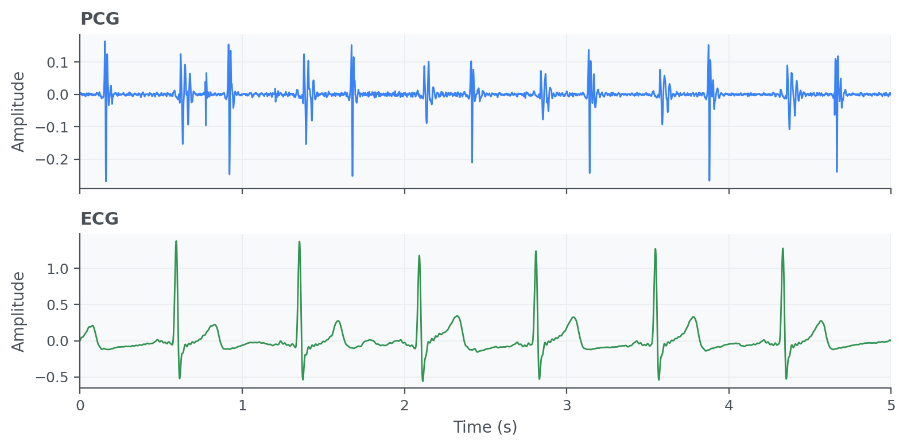
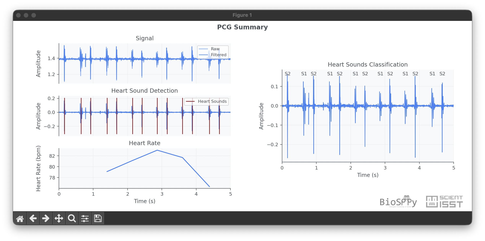

Phonocardiogram (PCG)
=====================

Phonocardiogram (PCG) signals capture acoustic information from heart sounds,
including S1 and S2 components and their temporal structure. PCG analysis can
complement electrical measurements and help characterize mechanical aspects of
cardiac function.

API quick links: :py:mod:`biosppy.signals.pcg` | :py:func:`biosppy.signals.pcg.pcg`

Quick Usage with :py:func:`biosppy.signals.pcg.pcg`
---------------------------------------------------

.. code-block:: python

    import numpy as np
    from biosppy.signals import pcg

    signal = np.loadtxt("examples/pcg.txt")

    out = pcg.pcg(signal=signal, sampling_rate=1000.0, show=False)
    print(out.keys())

**Inputs**

- ``signal``: raw phonocardiogram waveform.
- ``sampling_rate``: acquisition frequency in Hz.
- ``units`` / ``path`` / ``show``: optional metadata, save path, and plotting flag.

**Outputs**

- A ``ReturnTuple`` with processed PCG outputs, including filtered signal,
  heart-sound markers, and heart-rate related descriptors.
- Use ``out.keys()`` to inspect all available fields.

Example of PCD summary plot:

