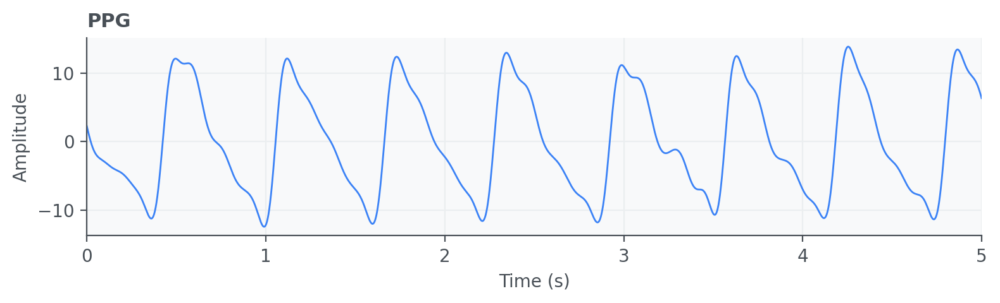
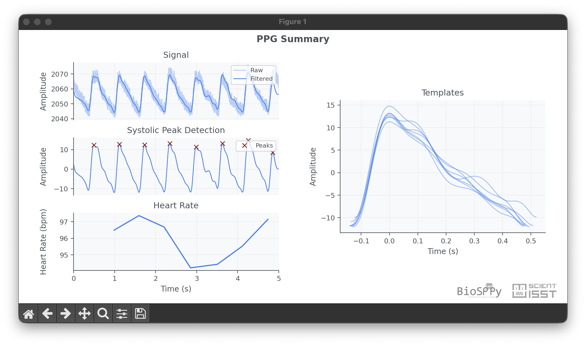

Photoplethysmogram (PPG)
========================

Photoplethysmogram (PPG) signals are optical measurements of peripheral blood
volume changes and are widely used in wearable health monitoring. PPG supports
pulse detection, heart rate estimation, and variability analysis with low-cost
sensor setups.

API quick links: :py:mod:`biosppy.signals.ppg` | :py:func:`biosppy.signals.ppg.ppg`

Quick Usage with :py:func:`biosppy.signals.ppg.ppg`
---------------------------------------------------

.. code-block:: python

    import numpy as np
    from biosppy.signals import ppg

    signal = np.loadtxt("examples/ppg.txt")

    out = ppg.ppg(signal=signal, sampling_rate=1000.0, show=False)
    print(out.keys())

**Inputs**

- ``signal``: raw PPG samples.
- ``sampling_rate``: acquisition frequency in Hz.
- ``units`` / ``show``: optional units label and plotting control.

**Outputs**

- A ``ReturnTuple`` with processed PPG outputs, usually including filtered
  signal, pulse onsets/peaks, and heart-rate related descriptors.
- Use ``out.keys()`` to inspect returned values.

Example of PPG summary plot:

