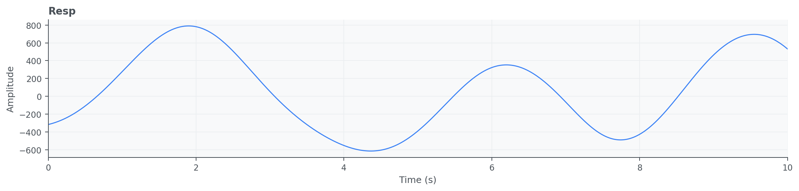
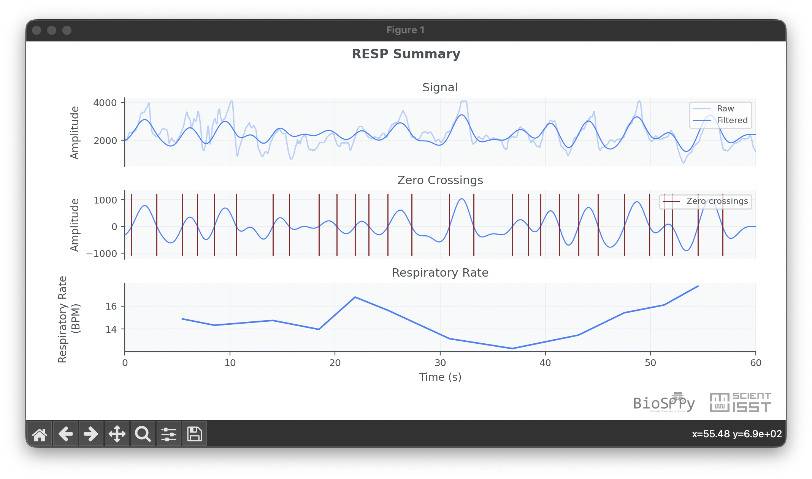

Respiration (RESP)
==================

Respiration (RESP) signals describe breathing dynamics over time and provide
useful information about respiratory rate, cycle morphology, and ventilatory
patterns. They are frequently analyzed alongside cardiovascular signals to
capture cardiorespiratory interactions.

API quick links: :py:mod:`biosppy.signals.resp` | :py:func:`biosppy.signals.resp.resp`

Quick Usage with :py:func:`biosppy.signals.resp.resp`
-----------------------------------------------------

.. code-block:: python

    import numpy as np
    from biosppy.signals import resp

    signal = np.loadtxt("examples/resp.txt")

    out = resp.resp(signal=signal, sampling_rate=1000.0, show=False)
    print(out.keys())

**Inputs**

- ``signal``: raw respiration waveform.
- ``sampling_rate``: acquisition frequency in Hz.
- ``units`` / ``path`` / ``show``: optional metadata and plotting options.

**Outputs**

- A ``ReturnTuple`` with processed respiration outputs, including timestamps,
  filtered signal, respiratory cycle markers, and rate-related information.
- Use ``out.keys()`` to inspect exact output names.

Example of RESP summary plot:

