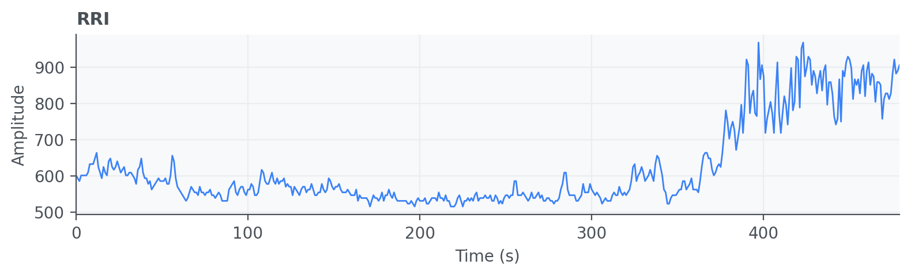
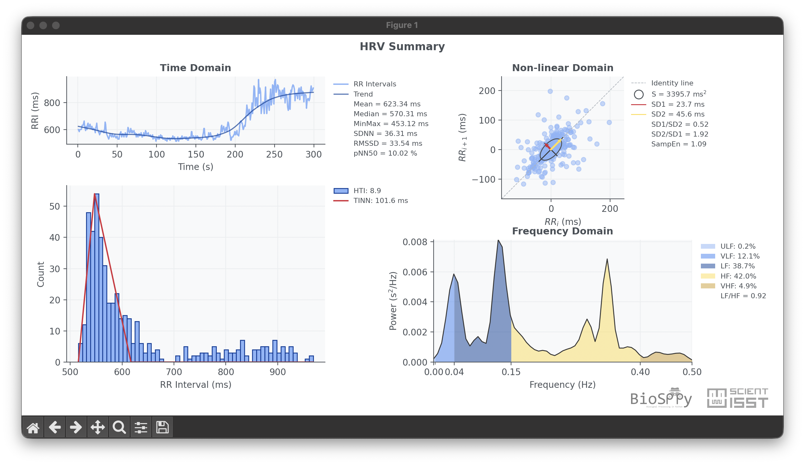

R-R Intervals (RRI) / HRV
=========================

R-R interval (RRI) signals represent the beat-to-beat timing series extracted
from cardiac peaks and are the core input for heart rate variability (HRV)
analysis. RRI processing helps quantify autonomic modulation through temporal
and spectral descriptors.

API quick links: :py:mod:`biosppy.signals.hrv` | :py:func:`biosppy.signals.hrv.hrv`

Quick Usage with :py:func:`biosppy.signals.hrv.hrv`
---------------------------------------------------

.. code-block:: python

    import numpy as np
    from biosppy.signals import hrv

    # RRI in milliseconds.
    rri = np.loadtxt("examples/rri.txt")

    out = hrv.hrv(rri=rri, sampling_rate=1000.0, show=False)
    print(out.keys())

**Inputs**

- ``rri``: beat-to-beat intervals (ms), or alternatively ``rpeaks`` with
  ``sampling_rate`` to derive RRI internally.
- ``rri_min`` / ``rri_max``: optional physiological bounds for artifact control.
- ``parameters``: which HRV feature families to compute.

**Outputs**

- A ``ReturnTuple`` with HRV results (time-domain, frequency-domain, and
  non-linear descriptors, depending on selected parameters).
- Use ``out.keys()`` to inspect all computed metrics.

Example of HRV summary plot:

