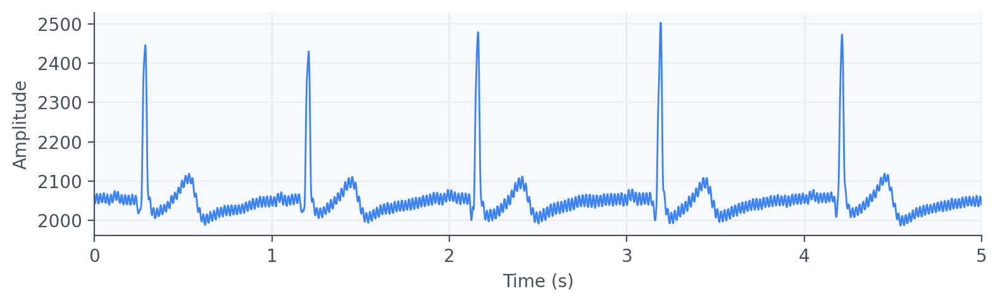
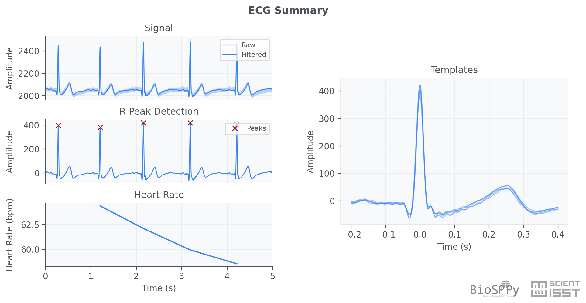

Getting Started
===============

``BioSPPy`` is organized around a simple idea: start with ready-to-use
processing pipelines for common biosignals, and then drill down into more
specialized modules as your analysis grows.

This page gives a quick mental model of the package and then walks through a
complete ECG example using the sample data included in the repository.

How ``BioSPPy`` is organized
----------------------------

Most users begin in one of these places:

* :doc:`biosppy.signals` contains signal-specific pipelines such as
  :py:func:`biosppy.signals.ecg.ecg`, :py:func:`biosppy.signals.eda.eda`, and
  :py:func:`biosppy.signals.ppg.ppg`. These are the highest-level entry points
  and are usually the best place to start.
* :py:mod:`biosppy.signals.tools` provides lower-level reusable operations such
  as filtering, smoothing, and heart-rate estimation.
* :py:mod:`biosppy.storage` handles loading and saving data. In this tutorial we
  will use :py:func:`biosppy.storage.load_txt` to read an example ECG file.
* :py:mod:`biosppy.plotting` and :doc:`biosppy.inter_plotting` generate the
  summary figures produced by the processing pipelines.
* :doc:`biosppy.features` provides feature extraction methods in time,
  frequency, cepstral, time-frequency, and phase-space domains.
* :py:mod:`biosppy.quality` contains signal quality assessment utilities.
* :doc:`biosppy.synthesizers` contains synthetic signal generators useful for
  simulation and testing.

Across the package, many functions return a
:py:class:`biosppy.utils.ReturnTuple`. This behaves like a regular tuple, but it
also lets you access results by name. See :doc:`returntuple` for details.

A typical workflow looks like this:

1. Load a signal with :py:mod:`biosppy.storage` or your own I/O code.
2. Process it with a signal-specific function from :doc:`biosppy.signals`.
3. Inspect the named outputs from the returned
   :py:class:`biosppy.utils.ReturnTuple`.
4. Plot, save, or pass those outputs into downstream analysis.

ECG example
-----------

The repository includes example signals in the ``examples/`` folder (available
`on GitHub <https://github.com/ScientISST/BioSPPy/tree/master/examples>`__). We
will use ``examples/ecg.txt`` to demonstrate the workflow.

Step 1: load and inspect the raw ECG signal
~~~~~~~~~~~~~~~~~~~~~~~~~~~~~~~~~~~~~~~~~~~

The example below loads the ECG recording, reads its metadata, builds a time
axis, and plots the raw waveform.

.. code-block:: python

    import matplotlib.pyplot as plt
    import numpy as np

    from biosppy import storage

    data_path = "examples/ecg.txt"
    signal, metadata = storage.load_txt(data_path)

    sampling_rate = metadata["sampling_rate"]
    n_samples = len(signal)
    duration = (n_samples - 1) / sampling_rate
    ts = np.linspace(0, duration, n_samples, endpoint=False)

    plt.figure(figsize=(10, 4))
    plt.plot(ts, signal, lw=1.5)
    plt.xlabel("Time (s)")
    plt.ylabel("Amplitude")
    plt.title("Raw ECG signal")
    plt.grid(True)
    plt.tight_layout()
    plt.show()

This should produce a plot similar to the one shown below.

For this example, the metadata indicates a sampling rate of 1000 Hz. The raw
signal is already usable, but you can still see typical acquisition artifacts
such as baseline offset and high-frequency interference.

Step 2: run the ECG processing pipeline
~~~~~~~~~~~~~~~~~~~~~~~~~~~~~~~~~~~~~~~

Now process the same signal with :py:func:`biosppy.signals.ecg.ecg`:

.. code-block:: python

    from biosppy.signals import ecg

    out = ecg.ecg(signal=signal, sampling_rate=sampling_rate, show=True)

This single call performs the standard high-level ECG workflow:

* bandpass filtering,
* DC offset removal,
* R-peak detection,
* heartbeat template extraction, and
* instantaneous heart-rate estimation.

With ``show=True``, ``BioSPPy`` also generates a summary plot like the one
below.

Step 3: inspect the outputs
~~~~~~~~~~~~~~~~~~~~~~~~~~~

The ECG pipeline returns a :py:class:`biosppy.utils.ReturnTuple` with named
results:

.. code-block:: python

    print(out.keys())

Typical keys include:

* ``ts``: time axis for the filtered ECG signal;
* ``filtered``: filtered ECG waveform;
* ``rpeaks``: indices of detected R-peaks;
* ``templates_ts`` and ``templates``: extracted heartbeat templates;
* ``heart_rate_ts`` and ``heart_rate``: timestamps and instantaneous heart rate
  in beats per minute.

You can access values either by position or by name:

.. code-block:: python

    ts = out[0]
    filtered = out["filtered"]
    rpeaks = out["rpeaks"]
    heart_rate = out["heart_rate"]

Named access is usually more convenient when exploring a pipeline
interactively.

Step 4: reuse the extracted results
~~~~~~~~~~~~~~~~~~~~~~~~~~~~~~~~~~~

Once you have the outputs, you can build custom plots or downstream analysis.
For example, this snippet overlays the detected R-peaks on top of the filtered
signal:

.. code-block:: python

    plt.figure(figsize=(10, 4))
    plt.plot(out["ts"], out["filtered"], label="Filtered ECG", lw=1.5)
    plt.plot(
        out["ts"][out["rpeaks"]],
        out["filtered"][out["rpeaks"]],
        "ro",
        label="R-peaks",
        markersize=4,
    )
    plt.xlabel("Time (s)")
    plt.ylabel("Amplitude")
    plt.legend()
    plt.grid(True)
    plt.tight_layout()
    plt.show()

If you want to save the standard ECG summary figure instead of displaying it,
pass a file path:

.. code-block:: python

    out = ecg.ecg(
        signal=signal,
        sampling_rate=sampling_rate,
        path="ecg_summary.png",
        show=True,
    )

Where to go next
----------------

* For signal-specific documentation, continue to :doc:`biosignals/index`.
* For the complete API, see :doc:`biosppy`.
* For the ``ReturnTuple`` container used throughout the project, see
  :doc:`returntuple`.

Once you are comfortable with the ECG example, the same pattern applies to
other supported biosignals: load a recording, call the corresponding pipeline
from :doc:`biosppy.signals`, and inspect the named outputs.

