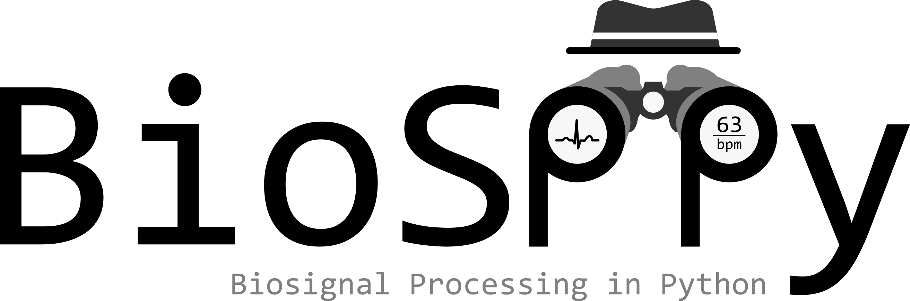
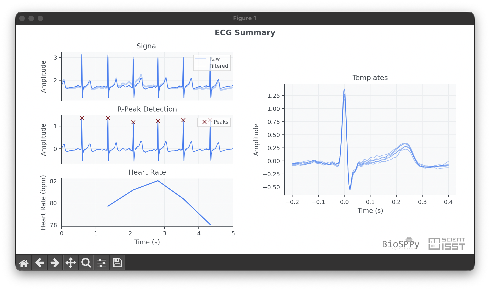

Welcome to ``BioSPPy``
======================

|

|
|
|

|

|
|
|

``BioSPPy`` is a toolbox for biosignal processing written in Python.
The toolbox bundles together signal processing, visualization, feature
extraction, quality assessment, synthesis, and pattern recognition methods
geared towards the analysis of physiological signals.

Whether you are exploring a single ECG recording, prototyping a signal quality
pipeline, extracting domain-specific features, or benchmarking biosignal
algorithms, ``BioSPPy`` provides both ready-to-use high-level workflows and the
lower-level building blocks behind them.

Highlights:

-  Turnkey signal-processing pipelines for common biosignals
-  Signal analysis primitives such as filtering, smoothing, spectral analysis,
   segmentation, and heart-rate estimation
-  Feature extraction in time, frequency, cepstral, time-frequency, and
   non-linear / phase-space domains
-  Signal quality assessment utilities
-  Synthetic signal generators for simulation and testing
-  Interactive and publication-style plotting utilities
-  Clustering and biometrics tools for downstream analysis

Supported biosignals
--------------------

``BioSPPy`` includes support for a broad range of physiological signals,
including:

-  ACC (Accelerometry)
-  ABP (Arterial Blood Pressure)
-  BCG (Ballistocardiography)
-  BVP (Blood Volume Pulse)
-  ECG (Electrocardiography)
-  EDA (Electrodermal Activity)
-  EEG (Electroencephalography)
-  EGM (Electrogram)
-  EMG (Electromyography)
-  PCG (Phonocardiography)
-  PPG (Photoplethysmography)
-  Respiration
-  RRI / HRV (RR intervals and heart-rate variability analysis)

For signal-specific overviews and examples, see :doc:`biosignals/index`.

Main modules at a glance
------------------------

-  :doc:`gettingstarted` for the package overview and first ECG walkthrough
-  :doc:`biosignals/index` for biosignal-specific pages and examples
-  :doc:`biosppy` for the complete API reference
-  :doc:`returntuple` for the named return container used across the package
-  :doc:`biosppy.features` for feature extraction modules
-  :doc:`biosppy.synthesizers` for synthetic biosignal generation

Contents:

.. toctree::
   :maxdepth: 1

   gettingstarted
   returntuple
   biosignals/index
   biosppy
   howtocite

Installation
------------

Installation can be easily done with ``pip``:

.. code:: console

    $ pip install biosppy

Quick ECG example
-----------------

The code below loads an ECG signal from the ``examples`` folder, processes it,
detects R-peaks, and computes the instantaneous heart rate.

.. code:: python

    from biosppy import storage
    from biosppy.signals import ecg

    # load raw ECG signal
    signal, metadata = storage.load_txt('./examples/ecg.txt')

    # process it and plot
    out = ecg.ecg(signal=signal, sampling_rate=metadata['sampling_rate'], show=True)

This high-level pipeline returns a :py:class:`biosppy.utils.ReturnTuple`
containing named outputs such as the filtered signal, detected R-peaks,
heartbeat templates, and instantaneous heart rate.

Index
-----

* :ref:`genindex`
* :ref:`modindex`
* :ref:`search`
